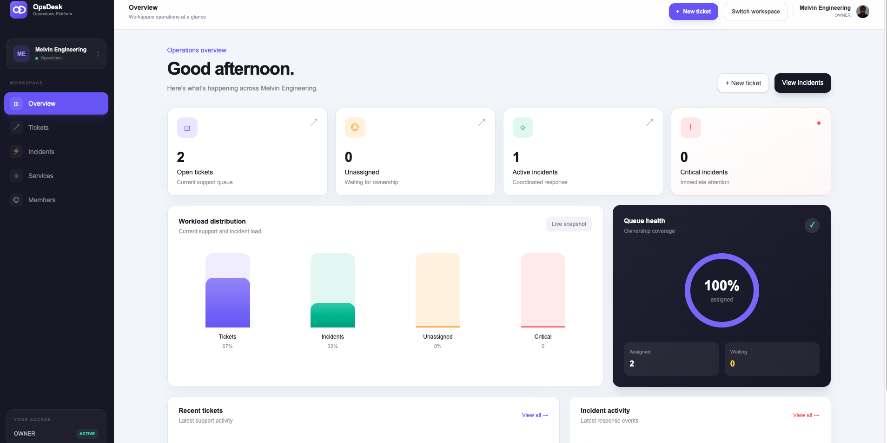
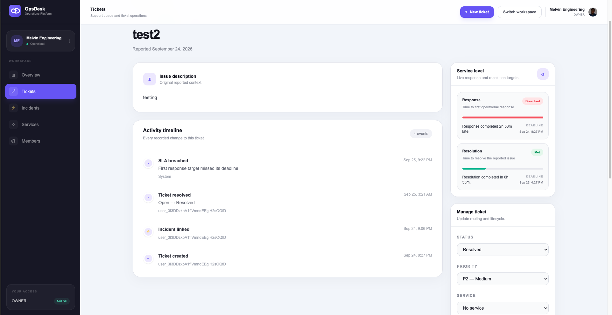

# OpsDesk

OpsDesk is a multi-tenant support and incident management app for engineering and operations teams.

It brings tickets, service ownership, incident escalation, activity history, and SLA tracking into one workspace.

> Built as a portfolio project to show full-stack product work beyond basic CRUD.



## What it does

A team can create a workspace, invite members, define services, open tickets, assign work, escalate serious issues into incidents, and track everything through an activity timeline.

Tickets also have response and resolution targets based on priority.

| Priority | First response | Resolution |
| -------- | -------------: | ---------: |
| P0       |         15 min |    4 hours |
| P1       |         1 hour |    8 hours |
| P2       |        4 hours |   24 hours |
| P3       |        8 hours |   72 hours |

The SLA panel shows whether each target is on track, at risk, breached, or met.



## Main features

- Multi-tenant workspaces
- Clerk authentication
- Server-side role-based access control
- Owner, Admin, Agent, and Viewer roles
- Workspace invitations and member management
- Service creation, editing, and archiving
- Ticket creation, assignment, status, and priority management
- Ticket activity history
- Ticket-to-incident escalation
- Incident ownership and lifecycle tracking
- Priority-based response and resolution SLAs
- SLA warning and breach activity
- Responsive product UI
- Automated tests for important business rules

## The part I cared about most

I did not want authorization to depend on whether a button was hidden in the browser.

Protected operations check the signed-in user, workspace membership, required permission, and resource ownership on the server.

The same idea is used throughout the database layer: tenant-owned records are queried with their workspace boundary instead of trusting a resource ID by itself.

The SLA flow also uses persisted timestamps and conditional database updates so warning and breach events are not repeatedly created when a ticket is loaded more than once.

## Stack

| Area           | Technology           |
| -------------- | -------------------- |
| Framework      | Next.js 16, React 19 |
| Language       | TypeScript           |
| Styling        | Tailwind CSS         |
| Authentication | Clerk                |
| Database       | PostgreSQL on Neon   |
| ORM            | Prisma               |
| Validation     | Zod                  |
| Testing        | Vitest               |
| Deployment     | Vercel               |

## How the app is structured

```text
Browser
   |
   v
Next.js
   |
   +-- Clerk -------- Authentication
   |
   +-- Server logic - Authorization + business rules
   |
   +-- Prisma
         |
         v
   PostgreSQL / Neon
```

The codebase is organized by feature instead of trying to split every domain into its own service.

```text
src/
├── app/
├── components/
├── features/
│   ├── incidents/
│   ├── invitations/
│   ├── members/
│   ├── services/
│   ├── tickets/
│   └── workspaces/
├── server/
│   ├── authorization/
│   └── database/
└── generated/
```

## A few engineering decisions

**Workspace is the tenant boundary.** Tickets, incidents, services, memberships, and activity all belong to a workspace.

**Authentication and authorization are separate.** Clerk identifies the user. OpsDesk decides what that user can do inside a workspace.

**Human-readable issue numbers are scoped per workspace.** Ticket and incident sequence values are incremented transactionally.

**Activity is part of the product.** Important changes create timeline events so a ticket or incident keeps useful history.

**SLA deadlines are stored.** The app does not recalculate historical targets only from the current priority policy.

## Run it locally

Requirements:

- Node.js 24
- PostgreSQL database
- Clerk application

Create `.env` from `.env.example`, then add your own credentials.

```bash
npm install
npx prisma generate
npx prisma migrate dev
npm run dev
```

Open `http://localhost:3000`.

## Quality checks

The project uses one command as the main local quality gate:

```bash
npm run check
```

That runs linting, TypeScript checks, automated tests, and a production build.

## More project notes

The deeper docs are intentionally short enough to scan:

- [Product requirements](docs/PRODUCT_REQUIREMENTS.md)
- [Architecture](docs/ARCHITECTURE.md)
- [Database design](docs/DATABASE.md)

## Current release vs. future ideas

The deployed version focuses on the complete workspace → ticket → incident workflow, permissions, activity history, and SLA tracking.

Ideas such as a dedicated background worker, real-time collaboration, attachments, public API keys, outbound webhooks, and a full audit system are not part of the current release. They are documented as future directions rather than presented as finished features.
